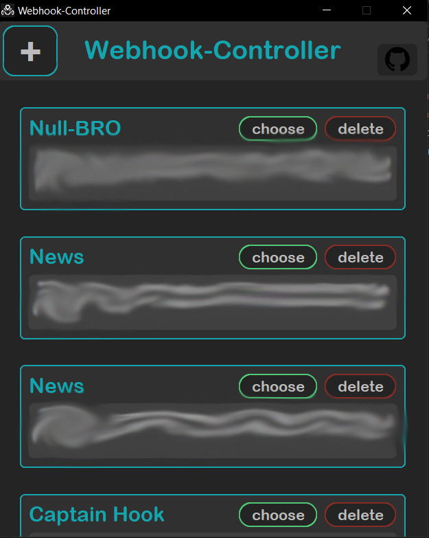
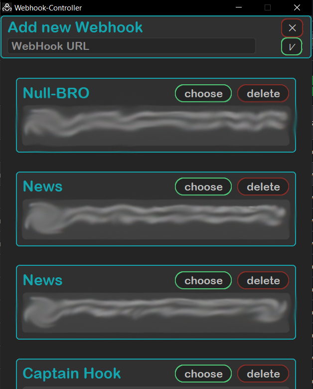

<a id ="up"></a>


>### Webhook-controller
> 🌐The prog for controlling discord webhooks written on python
>
> <p>
> 
>
>
>
>
 </p>

---

### 🖼Overview

User-friendly interface in the form of a list(it can contain any number of webhooks)



Сonvenient addition of a webhook



Easily use or remove unwanted webhooks


fast work and sending


---

### 🔐Secure
All saved webhooks are stored locally encrypted with 2 keys and 3 ways


---

### 📜Requirements(for building)
```
cryptography==41.0.1
customtkinter==5.1.2
Requests==2.31.0
```

---

### 🧱Building

change path to customtkinter in `to exe.bat` and run `to exe.bat`

---
### ❌Builder errors

If you have an error like this:


How to solve it read [here](https://www.stechies.com/pip-not-recognized-internal-external-command/)

If you have an error like this:


input in cmd `pip uninstall typing` and then input `y`


---
### 💰 Donate
<p>
   <a href="https://www.donationalerts.com/r/nick_vinesmoke"></a>
   <a href="https://patreon.com/NickVinesmoke"></a>
</p>
   
   BTS <code>bc1qfe46xsewu00yhl0llzaxhz9re03y4al0w9p3v2</code>
  
  ETH <code>0xeeA063838950D191881EdF0E31b4699B73aD20Ac</code>
  
  XMR: <code>83PXY1A4PvPWCwveY4cN5p5zFLKNF4KMGfzRnR4A8qPXRABzoHPoahUP4H6eP636FPYbkn76tzUJmcc2Lai3VFkLHdoe4QV</code>

---
### 📲Contacts
<p>
<a href="https://github.com/Nick-Vinesmoke"></a>
   <a href="https://discord.gg/ufvyg5F2j4"></a>
</p>
   
Our Discord server <a href="https://discord.gg/ufvyg5F2j4">join us</a>

---
[go up](#up)
